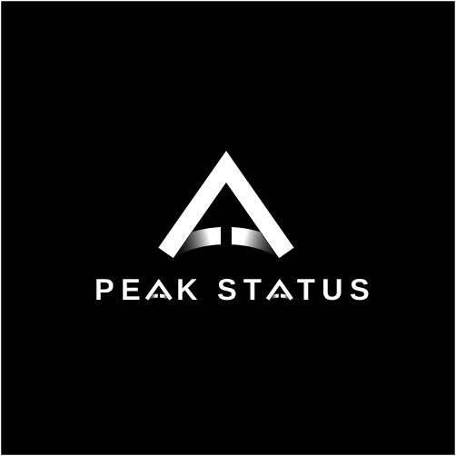

<div align="center">



# Peak Status

### Your Brand, at Its Peak

A **Cebu-based creative & digital growth studio** — this repository is the
studio's marketing website: a premium, single-page experience built with a
modern, production-ready stack.

<br />


**[ Live Site ↗](https://peak-status.vercel.app/)** &nbsp;·&nbsp;
[Highlights](#-highlights) &nbsp;·&nbsp;
[Tech Stack](#-tech-stack) &nbsp;·&nbsp;
[Team](#-team) &nbsp;·&nbsp;
[Getting Started](#-getting-started)

</div>

---

## ▲ Overview

**Peak Status** helps local businesses — restaurants, cafés, gyms, clinics, real
estate, startups, and Cebu SMEs — grow through branding, content, social media,
digital marketing, and practical web & automation work.

This site is a fully responsive, dark, premium one-page experience. Content is
**data-driven** (a single `src/data/site.ts` file), the design system is built
on the brand's monochrome palette with a subtle chrome accent, and the whole
thing ships with metadata, dynamic social images, and a deploy-time
"Coming Soon" gate.

> **Design language:** ink-black background `#060606`, off-white text, hairline
> borders, a metallic chrome gradient echoing the logo, geometric grid + glow
> accents, and restrained, motion-safe scroll animations.

---

## ✦ Highlights

- **One-page, anchor-navigated site** with a sticky, responsive header and a
  mobile menu.
- **12 polished sections** — Hero, About, Services, Industries, Work, Team,
  Process, Pricing, Tools, Contact, plus header & footer.
- **Fully data-driven** — edit copy, services, team, pricing, and contact details
  in one file (`src/data/site.ts`); components stay untouched.
- **Premium, on-brand UI** — custom theme tokens, chrome-gradient typography,
  geometric accents, and accessible color contrast.
- **SEO & social ready** — full metadata, Open Graph + Twitter cards, a
  **dynamically generated 1200×630 share image**, `robots.txt`, and `sitemap.xml`.
- **Coming Soon / maintenance gate** — a single source-code toggle that gates the
  **deployed** URL while keeping local development fully live.
- **Accessibility & polish** — semantic HTML, alt text, keyboard-friendly nav,
  and `prefers-reduced-motion` support.
- **Zero unnecessary dependencies** — just Next.js, React, and Tailwind.

---

## ✦ Tech Stack

| Layer | Technology |
| --- | --- |
| Framework | **Next.js 15** (App Router) |
| Language | **TypeScript** |
| UI runtime | **React 19** |
| Styling | **Tailwind CSS v4** (CSS-first theme tokens) |
| Fonts | `next/font` — Space Grotesk (display) + Inter (body) |
| Images | `next/image` (optimized brand assets) |
| Social image | `next/og` (dynamic OG / Twitter card) |
| Linting | **ESLint 9** (flat config, `eslint-config-next`) |
| Hosting | **Vercel** |

---

## ✦ What's Inside

| Section | Purpose |
| --- | --- |
| **Hero** | Brand mark + the tagline *"Your Brand, at Its Peak"* + primary CTAs |
| **About** | Who Peak Status is, why it exists, and honest value props |
| **Services** | Four groups: Branding · Content & Social · Marketing & Growth · Web & Automation |
| **Industries** | Food & Beverage, Fitness, Clinics, Real Estate, Startups, SMEs |
| **Work** | *Selected Work From Our Team* — creative & technical portfolio buckets |
| **Team** | Data-driven member cards with roles, skills, and portfolio links |
| **Process** | A 5-step path: Discover → Design → Build → Launch → Optimize |
| **Pricing** | Sample starting packages (toggle-able via `showPricing`) |
| **Tools** | Creative & marketing toolkit, tastefully presented |
| **Contact** | Final CTA, email + phone, and a `mailto`-backed contact form |

---

## ✦ Team

| Member | Role | Links |
| --- | --- | --- |
| **Kenneth Ayade** | Technical & Digital Systems | [Portfolio ↗](https://kenneth-ayade-portfolio.vercel.app/) |
| **Brian Diaz** | Creative & Design | — |
| **John Cadungog** | Software Engineer & UI/UX Designer | [Portfolio ↗](https://johncadungog.github.io/Portfolio/#home) · [Behance ↗](https://www.behance.net/johncadungog1) |
| *Coming soon* | *Role to be added* | — |
| *Coming soon* | *Role to be added* | — |

> The studio is a team of five; three profiles are live and two are on the way.
> No names, roles, or details are ever invented — placeholders stay placeholders
> until verified.

---

## 🚀 Getting Started

```bash
npm install      # install dependencies
npm run dev      # start the dev server at http://localhost:3000
npm run build    # production build
npm run start    # serve the production build
npm run lint     # run ESLint
```

Requires Node.js 18.18+ (Node 20+ recommended).

---

## 🗂 Project Structure

```
.
├── Logo/                          # Original brand assets (source of truth — do not delete)
├── public/brand/                  # Optimized logos used by the site
├── src/
│   ├── app/
│   │   ├── layout.tsx             # Fonts + metadata (title, description, Open Graph)
│   │   ├── page.tsx               # Composes all sections
│   │   ├── globals.css            # Theme tokens + base styles + utilities
│   │   ├── opengraph-image.tsx    # Dynamic 1200×630 social image (+ twitter-image)
│   │   ├── coming-soon/page.tsx   # The maintenance / Coming Soon page
│   │   ├── icon.png               # Favicon (from the submark logo)
│   │   └── robots.ts / sitemap.ts # SEO routes
│   ├── components/                # Header, Hero, About, Services, Industries,
│   │   │                          # Portfolio, Team, Process, Pricing, Tools,
│   │   │                          # Contact, Footer, ComingSoon
│   │   └── ui/                    # Section, SectionHeading, Reveal (shared)
│   ├── config/site-mode.ts        # Coming Soon toggle (MAINTENANCE_MODE)
│   ├── data/site.ts               # ALL editable content + config lives here
│   └── middleware.ts              # Enforces the Coming Soon gate on deployments
```

---

## ✏️ Editing Content

Almost everything is data-driven. Update `src/data/site.ts` to change copy,
services, industries, team members, pricing, tools, and contact details.

Useful flags / fields:

- `siteConfig.showPricing` — set to `false` to hide the entire pricing section.
- `siteConfig.email` / `siteConfig.phone` — official contact details.
- `siteConfig.url` — replace with the real domain (used for metadata/SEO).
- `siteConfig.socials` — add real URLs to reveal social links in the footer.
- `team[]` — two entries are placeholders (`status: "coming-soon"`).

---

## 🌙 Coming Soon / Maintenance Mode

A single toggle gates a "Coming Soon" page for the **deployed** site only:

- **File:** `src/config/site-mode.ts` → `MAINTENANCE_MODE`
- `false` → full site is live everywhere.
- `true` → the deployed URL (e.g. `https://peak-status.vercel.app`) shows only
  the Coming Soon page. **Localhost always shows the full site**, so you can keep
  working while the public URL is gated.

How it works: `src/middleware.ts` rewrites all requests to `/coming-soon` when
the toggle is on and the request host is not local. Detection is **host-based**
(not `NODE_ENV`), so `npm run start` locally still shows the full site.

```text
To gate the live URL → set MAINTENANCE_MODE = true,  commit, deploy.
To launch            → set MAINTENANCE_MODE = false, commit, deploy.
```

Preview the Coming Soon page locally any time: `http://localhost:3000/coming-soon`.

---

## ✅ Before Launch

1. **Domain** — set `siteConfig.url` to the real domain once registered.
2. **Portfolio images** — replace placeholder Work cards (see TODOs in
   `Portfolio.tsx` and `src/data/site.ts`); drop assets in `public/work/...`.
3. **Team** — add member photos and the two remaining profiles.
4. **Contact form backend** — currently a `mailto:` fallback; wire a provider
   (Resend / Formspree / a Route Handler) per the TODO in `Contact.tsx`.
5. **Social links** — fill `siteConfig.socials`.
6. **Review** — confirm pricing and tools before publishing.
7. **Go live** — set `MAINTENANCE_MODE = false` and deploy.

> **Content rule:** keep everything professional and honest. No fake
> testimonials, client results, case studies, metrics, awards, or invented team
> details.

---

## ✉️ Contact

- **Email:** peakstatusmarketing@gmail.com
- **Phone:** 0945 283 8035
- **Location:** Cebu, Philippines

---

<div align="center">

**Peak Status** — Your Brand, at Its Peak.
<br />
<sub>Proprietary © Peak Status. All rights reserved.</sub>

</div>
